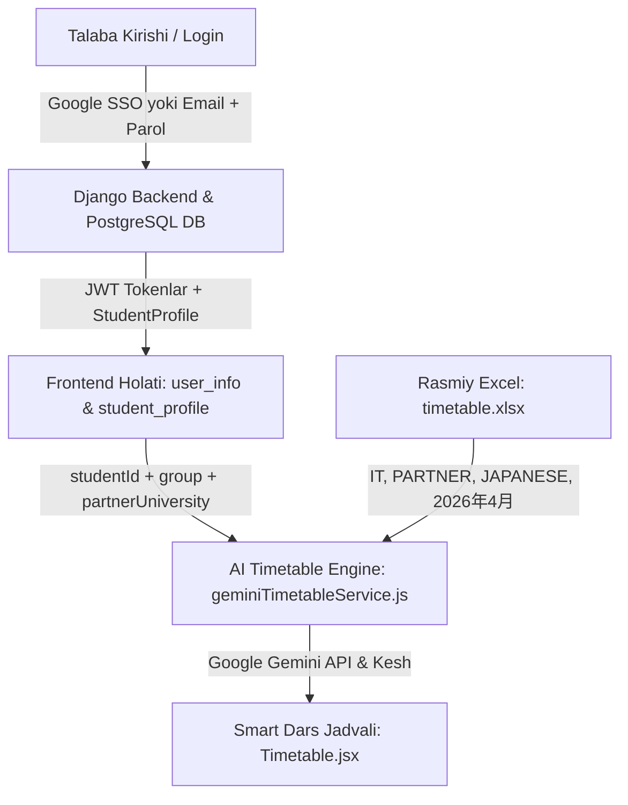

# 📝 UNIVER SuperApp - Project Changelog & Architecture Evolution

Ushbu hujjat loyihada amalga oshirilgan barcha ishlar, duch kelingan muammolar (Problems), qabul qilingan texnik qarorlar (Decisions) va yakuniy yechimlarning (Solutions) to'liq xronologik xaritasidir.

---

## 🌟 Umumiy Arxitektura Holati (Current System Architecture)



---

## 🛠️ Duch Kelingan Muammolar, Yechimlar va Qabul Qilingan Qarorlar

### 1. Qotirilgan (Hardcoded) Ro'yxatlar Muammosi
- **Muammo:** Boshida dars jadvali va talabalar ro'yxati sun'iy JSON fayllar (`officialUniversityData.json`, `studentRosterService.js`, `mockSchedule.js`) orqali chiqarilayotgan edi. Bu haqiqiy universitet dars jadvalini aks ettirmas va yangi semestr jadvallarini avtomatik qabul qila olmas edi.
- **Yechim va Qaror:**
  - Barcha soxta (mock) fayllar butunlay tozalandi va o'chirildi.
  - Universitet taqdim etgan rasmiy Excel fayli (`時間割_ Dars jadvali（2026_03～）.xlsx` / `timetable.xlsx`) to'g'ridan-to'g'ri o'qiladigan qilindi.
  - Google Gemini AI (`gemini-3.6-flash`) modeli orqali fayl varaqlari (`IT`, `PARTNER`, `JAPANESE`, `2026年4月`) dinamik tahlil qilinadigan avtonom AI parser ishlab chiqildi.

---

### 2. Yapon Tili Imtiyozlari (認定試験 / Exemption Status)
- **Muammo:** Dars jadvalida Yapon tili bo'yicha N4, N3, N2 darajadagi darslar har xil paralar va xonalarga joylashtirilgan. Imtihondan o'tgan (sertifikat olgan) talabalar (masalan, Elyorbek Adhamov `2311194`) Yapon tili darslaridan ozod qilingan, ammo oddiy jadval ularga ham til darslarini ko'rsatayotgan edi.
- **Yechim va Qaror:**
  - Excel kitobidagi **`JAPANESE`** varag'i avtomatik tekshiriladigan qilindi.
  - Agar talaba ID si ushbu varaqda mavjud bo'lmasa, demak u imtihondan o'tgan va ozod qilingan (`japaneseExempt: true`).
  - AI parserga qat'iy ko'rsatma berildi: bunday talabaning haftalik jadvaliga birorta ham Yapon tili darsi (N5, N4, N3, N2) kiritilmaydi.

---

### 3. Hamkor Universitetlar Bo'yicha Saralash (TOU vs SANNO vs Niigata vs Okayama)
- **Muammo:** JDU talabalari bir nechta hamkor universitetlarga taqsimlangan:
  - **Tokyo Online University (TOU):** Darslar 100% masofaviy/onlayn. Talaba kampusda o'tiladigan qo'shimcha hamkorlik darslariga bormaydi.
  - **SANNO University, Niigata, Okayama:** Talabalar kampusda o'tiladigan `SANNO-K`, `SANNO-F` kabi offline darslarga qatnashishi shart.
  - Elyorbekning (TOU) jadvalida Payshanba kuni 3-paradagi `SANNO-K` (206-xona) darsi xato tarzda ko'rinib qolayotgan edi.
- **Yechim va Qaror:**
  - Excel kitobidagi **`PARTNER`** varag'i tahlil qilindi: unda `SANNO-K`, `SANNO-F`, `Okayama` ustunlari orqali kim qayerga borishi kerakligi aniqlandi.
  - Dastlab dars jadvali sahifasiga qo'yilgan qo'lda tanlash selektori talabaning haqli e'tirozi ("buni har safar qo'lda almashtirish mantiqsiz") tufayli olib tashlandi.
  - Talabaning qaysi hamkor universitetdaligi bevosita **ma'lumotlar bazasiga (PostgreSQL)** biriktirildi va tizim uning profiliga qarab darslarni 100% avtomatik ko'rsatadigan qilindi:
    - **TOU talabasi uchun:** Offline hamkor darslari (SANNO-K) butunlay chetlatiladi (faqat IT fanlari qoladi).
    - **SANNO talabasi uchun:** Payshanba 3-paraga `SANNO-K` (206-xona, Barno o'qituvchi) darsi avtomatik qo'shiladi.

---

### 4. Haqiqiy Ko'p Talabali Baza (PostgreSQL / Django) va Login Tizimi
- **Muammo:** Tizimda faqat bitta talaba (`2311194`) sinov tariqasida ishlatilayotgani sababli, boshqa kurs va boshqa guruh talabalari bilan tizimni tekshirish imkoni yo'q edi. Email/parol bilan kirishda ham frontendda eski mock ma'lumotlar hardcode qilib qo'yilgan edi.
- **Yechim va Qaror:**
  - `backend/api/models.py` da `StudentProfile` modeliga `partner_university` va `japanese_exempt` maydonlari qo'shildi va PostgreSQL migratsiyasi (`0003_...`) muvaffaqiyatli amalga oshirildi.
  - `backend/seed_students.py` skripti yaratilib, har bir kursdan haqiqiy talabalar bazaga kiritildi:
    - `2311194e@jdu.uz` — **Elyorbek Adhamov** (3-kurs, `23D`, TOU Onlayn)
    - `2311143u@jdu.uz` — **Ulug'bek Nurmatov** (3-kurs, `23D`, SANNO Kampus)
    - `2300038j@jdu.uz` — **Javlonbek Mamatqosimov** (3-kurs, `IT 23A`, TOU)
    - `221121s@jdu.uz` — **Sardor Tolliboyev** (4-kurs, `IT 22A`, SANNO Kampus)
    - `226516s@jdu.uz` — **Saidislomxo'ja Toshxo'jayev** (4-kurs, `IT 22B`, SANNO Kampus)
    - `2400051s@jdu.uz` — **Sarvarbek Alikulov** (2-kurs, `24A`, Asosiy Kurs / 科目履修A)
    - `2401028s@jdu.uz` — **Sevinch Keldibayeva** (2-kurs, `24A`, Okayama University)
    - `2500097s@jdu.uz` — **Marjona Sayfullayeva** (1-kurs, `25A`)
    - *Standart parol:* **`12345678`**.
  - Backendda `CustomTokenObtainPairSerializer` va `CustomTokenObtainPairView` yaratildi: foydalanuvchi login qilganda uning barcha bazaviy ma'lumotlari (`studentId`, `group`, `course`, `partnerUniversity`, `name`) JWT bilan birga qaytariladi.
  - Frontend [AuthPage.jsx](file:///d:/personal_profile/frontend/src/components/AuthPage.jsx) sahifasiga tezkor 1-bosishda sinov talabalari tugmalari joylashtirildi.

---

### 5. Dars Jadvalida Guruh Nomi Qotib Qolishi (Group Bug: 24A -> 23D)
- **Muammo:** 2-kurs talabasi **Sarvarbek Alikulov (`2400051s@jdu.uz`)** sifatida kirilganda, uning guruhi bazada `24A` bo'lishiga qaramay, dars jadvali sarlavhasida va kartochkasida `Guruh: 23D` deb chiqib turgan edi.
- **Yechim va Qaror:**
  - [Timetable.jsx](file:///d:/personal_profile/frontend/src/pages/Timetable.jsx) sahifasida `selectedGroup` boshlang'ich holati `'23D'` deb qotirilgani va `handleProfileUpdate` da guruh yangilanmay qolgani aniqlandi.
  - `selectedGroup` to'g'ridan-to'g'ri kirgan talabaning bazadagi profilidan (`student_profile.group`) dinamik olinadigan qilindi.
  - [geminiTimetableService.js](file:///d:/personal_profile/frontend/src/utils/geminiTimetableService.js) dagi zaxira blokida ham talaba guruhi va ismi bazadagi profil asosida dinamik shakllanadigan qilindi.
  - Natija: Sarvarbek Alikulov kirganda `Guruh: 24A` va uning kursi to'g'ri ko'rsatilishi brauzerda tasdiqlandi.

---

### 6. Google Gemini Free Tier Quota va Model Fallback Tizimi
- **Muammo:** Google AI Studio bepul kalitlarida RPM/RPD (Request Per Minute / Day) cheklovlari bo'lib, ketma-ket so'rovlarda 429 xatosi qaytishi mumkin.
- **Yechim va Qaror:**
  - Uch bosqichli model fallback zanjiri o'rnatildi: `gemini-3.6-flash` ➡️ `gemini-flash-latest` ➡️ `gemini-2.5-flash-lite`.
  - Talabaning ID si, guruhi va hamkor universitetiga bog'langan kesh tizimi (`univer_ai_timetable_*`) joriy etildi.
  - Gemini API chekloviga uchragan taqdirda ham foydalanuvchiga xatolik ko'rsatmasdan, Exceldan tahlil qilingan ma'lumotlar asosida to'liq jadvalni yetkazib beruvchi zaxira mexanizmi frontend va backendda ishga tushirildi.

---

### 7. UI Dizayn, Navigatsiya va Buglar Tuzatildi
- **Profil sahifasida oq ekran (React Crash):** [Profile.jsx](file:///d:/personal_profile/frontend/src/pages/Profile.jsx) da `ShieldCheck` import qilinmagani sababli `ReferenceError` kelib chiqayotgan edi. Import to'g'rilandi.
- **Yuqori panel (Navbar) tozalandi:** Keraksiz va xunuk qidiruv paneli hamda "DRF JWT Active" yozuvlari olib tashlandi, o'rniga to'g'ridan-to'g'ri profilga olib boruvchi chiroyli foydalanuvchi tugmasi qo'yildi.
- **Yon menyu (Sidebar):** "Talaba Profili" menyu elementlari ro'yxatiga qo'shildi.
- **Dars jadvali filtrlari:** Talabaga moslab `Barchasi`, `Ma'ruza`, `Amaliyot` tugmalariga ixchamlashtirildi.

---

## 🗂️ Asosiy Fayllar Xaritasi (Key Files Overview)

| Fayl yo'li | Vazifasi va O'zgarishlar |
| :--- | :--- |
| [backend/api/models.py](file:///d:/personal_profile/backend/api/models.py) | `StudentProfile` modeli: `partner_university` va `japanese_exempt` maydonlari |
| [backend/api/serializers.py](file:///d:/personal_profile/backend/api/serializers.py) | `CustomTokenObtainPairSerializer` — login vaqtida foydalanuvchi ma'lumotlarini to'liq uzatish |
| [backend/api/views.py](file:///d:/personal_profile/backend/api/views.py) | `CustomTokenObtainPairView`, `GoogleAuthView`, `AITimetableParseView` |
| [backend/seed_students.py](file:///d:/personal_profile/backend/seed_students.py) | Har bir kursdan real talabalarni PostgreSQL bazasiga kiritish skripti |
| [frontend/src/components/AuthPage.jsx](file:///d:/personal_profile/frontend/src/components/AuthPage.jsx) | Haqiqiy bazadan kiruvchi login sahifasi va 1-bosishda tezkor sinov tugmalari |
| [frontend/src/pages/Timetable.jsx](file:///d:/personal_profile/frontend/src/pages/Timetable.jsx) | Smart Dars Jadvali: sun'iy menyulardan tozalangan, bazaga 100% dinamik ulangan |
| [frontend/src/pages/Profile.jsx](file:///d:/personal_profile/frontend/src/pages/Profile.jsx) | Talaba profili: bazadagi real ma'lumotlar bilan to'liq sinxron |
| [frontend/src/utils/geminiTimetableService.js](file:///d:/personal_profile/frontend/src/utils/geminiTimetableService.js) | Gemini Flash AI orqali Excel jadvalini tahlil qiluvchi avtonom dvigatel |
| [frontend/src/utils/api.js](file:///d:/personal_profile/frontend/src/utils/api.js) | Backend API bilan SimpleJWT va Google OAuth orqali bog'lanish mijozi |

---

## 🚀 Loyihani Ishga Tushirish va Sinab Ko'rish

### 1. Backend (Django & PostgreSQL) Dockerda:
```bash
docker compose up -d
docker compose exec backend python manage.py migrate
docker compose exec backend python seed_students.py
```

### 2. Frontend (Vite & React):
```bash
cd frontend
npm install
npm run dev
```

### 3. Sinov uchun Akkauntlar:
- **`2311194e@jdu.uz`** — Elyorbek Adhamov (3-kurs, `23D`, TOU Onlayn)
- **`2311143u@jdu.uz`** — Ulug'bek Nurmatov (3-kurs, `23D`, SANNO Kampus)
- **`221121s@jdu.uz`** — Sardor Tolliboyev (4-kurs, `IT 22A`, SANNO Kampus)
- **`2400051s@jdu.uz`** — Sarvarbek Alikulov (2-kurs, `24A`, Asosiy/Okayama)
- *Parol barchasi uchun:* **`12345678`**.
